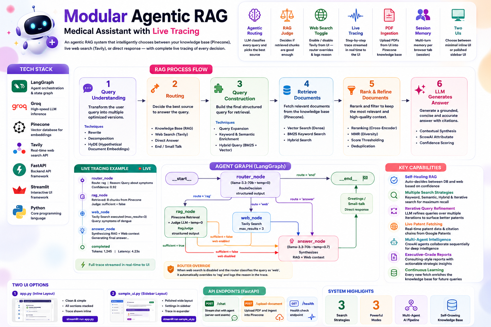
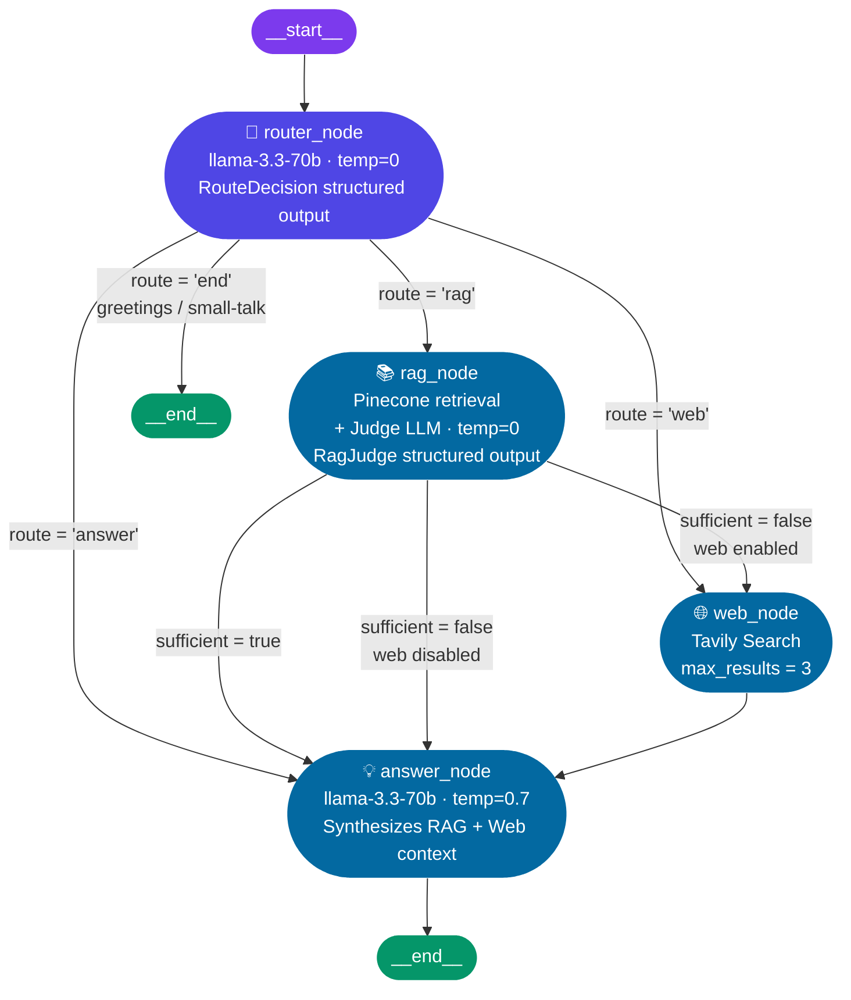

# 🏥 Modular Agentic RAG — Medical Assistant with Live Tracing



> A full-stack, production-shaped **Agentic RAG system** with a medical knowledge assistant powered by **LangGraph**, **Pinecone**, **Groq**, and **Tavily** — with a **FastAPI** backend and **two ready-to-run Streamlit UIs**.

The agent decides at runtime whether to answer from its indexed knowledge base (Pinecone), fall back to live web search (Tavily), or respond directly — and every decision is streamed back to the UI as a **live, step-by-step trace** so you can watch the agent reason in real time.

---

## ✨ Highlights

| | |
|---|---|
| 🧠 **Agentic routing** | Router LLM classifies every query and picks the best source |
| ⚖️ **RAG sufficiency judge** | A second LLM decides if retrieved chunks are good enough before answering |
| 🌐 **Web search toggle** | Disable Tavily from the UI — the router overrides itself and logs the reason |
| 🔬 **Live trace viewer** | Every node the agent visits is streamed back and rendered step-by-step |
| 📄 **PDF ingestion via UI** | Upload a PDF from the sidebar — chunks and embeds automatically into Pinecone |
| 🧵 **Session memory** | `MemorySaver` checkpointer keeps multi-turn context per browser tab |
| 🖥️ **Two UI styles** | Minimal inline UI (`app.py`) or polished sidebar-layout UI (`sample_ui.py`) |

---

## 🗺️ Repository Structure

```
├── backend/
│   ├── config.py          # Loads all API keys from .env
│   ├── vectorstore.py     # Pinecone index lifecycle + document ingestion
│   ├── agent.py           # LangGraph agent: all nodes, edges, and graph compilation
│   └── main.py            # FastAPI: /chat  /upload-document  /health
│
├── frontend/
│   ├── config.py          # Loads FASTAPI_BASE_URL from .env
│   ├── session_manager.py # UUID session state + message history init
│   ├── backend_api.py     # HTTP client calling FastAPI endpoints
│   ├── ui_components.py   # Shared Streamlit UI building blocks
│   ├── app.py             # UI option 1 — clean inline layout
│   └── sample_ui.py       # UI option 2 — polished wide layout with sidebar
│
├── main.py                # Project entry point
├── requirements.txt       # Python dependencies
└── pyproject.toml         # Project metadata
```

---

## 🤖 Agent Graph (LangGraph)



> **Router override:** when web search is disabled by the user and the router classifies the query as `web`, it automatically overrides to `rag` and logs the reason in the trace — so the decision is always visible and auditable.

---

## 🖥️ Two UI Options

Both UIs share the same backend, session manager, backend API client, and UI component library. **Only the layout and styling differ** — pick whichever fits your preference.

---

### Option 1 — `app.py` (Inline Layout)

A clean, straightforward layout where the PDF uploader, settings, and chat all stack vertically on one page. Trace events are rendered inline below each assistant response.

```bash
cd frontend
streamlit run app.py
```

```
┌─────────────────────────────────────┐
│  🤖 AI Agent Chatbot                │
│  ─────────────────────────────────  │
│  📄 Upload Document to KB           │
│  ─────────────────────────────────  │
│  ⚙️  Agent Settings                 │
│      [🌐 Enable Web Search ●]       │
│  ─────────────────────────────────  │
│  💬 Chat with the Agent             │
│                                     │
│  👤 What are the symptoms of ...    │
│  🤖 Based on the knowledge base...  │
│     ➡️ Step 1: router               │
│     📚 Step 2: rag_lookup ✅        │
│     💡 Step 3: answer               │
│  ─────────────────────────────────  │
│  [ Type your message...        ] ➤  │
└─────────────────────────────────────┘
```

---

### Option 2 — `sample_ui.py` (Polished Wide Sidebar Layout)

A refined `wide` layout with custom CSS, rounded chat bubbles, and all configuration (PDF uploader + web search toggle) moved into a **collapsible sidebar**. Trace events are hidden inside a collapsed `🔬 Agent Workflow Trace` expander — keeping the chat clean until you need to inspect.

```bash
cd frontend
streamlit run sample_ui.py
```

```
┌─────────────┬────────────────────────────────────────────┐
│  Sidebar    │  🤖 AI Agent Chatbot                       │
│             │  Ask me anything! I can use my KB or web.  │
│ ─────────── │  ──────────────────────────────────────── │
│ ⚙️ Settings │  ## 💬 Chat with the Agent                │
│  Web Search │                                            │
│  [toggle ●] │  👤 What is the treatment for diabetes?   │
│             │                                            │
│ ─────────── │  🤖 According to the knowledge base...    │
│ 📄 Upload   │                                            │
│  [PDF file] │  ▶ 🔬 Agent Workflow Trace  (collapsed)   │
│  [Upload ▶] │                                            │
│             │  ──────────────────────────────────────── │
│             │  [ Type your message...              ] ➤  │
└─────────────┴────────────────────────────────────────────┘
```

**What `sample_ui.py` adds over `app.py`:**
- `st.set_page_config(layout="wide")` for a wider canvas
- Custom CSS — `Inter`/`Segoe UI` font, rounded chat bubbles (`border-radius: 12px`), clean sidebar card borders
- Sidebar panel for settings + upload (keeps the chat area uncluttered)
- Trace events inside a collapsed `st.expander` rather than inline

---

## 🔬 Live Trace — What It Looks Like

After every response, the agent renders a step-by-step breakdown of what happened inside the graph:

| Step | Icon | Node | What's Shown |
|---|---|---|---|
| 1 | ➡️ | `router` | Decision made (`rag` / `web` / `answer` / `end`) + override reason if web was disabled |
| 2 | 📚 | `rag_lookup` | Retrieved content summary + sufficiency verdict (✅ green / ⚠️ yellow) |
| 3 | 🌐 | `web_search` | Web snippet summary (first 200 chars) |
| 4 | 💡 | `answer` | "Generating final answer using gathered context" |
| 5 | ✅ | `__end__` | "Agent process completed" |

---

## 📦 Installation

```bash
git clone https://github.com/paras160500/Modular-Advance-RAG-Medical-Assistant-with-Tracing.git
cd Modular-Advance-RAG-Medical-Assistant-with-Tracing
pip install -r requirements.txt
```

### 🔑 Environment Variables

Create a `.env` file in the project root:

```env
# Pinecone
PINECONE_API_KEY=your_pinecone_api_key
PINECONE_ENVIRONMENT=us-east-1          # AWS region for your serverless index
PINECONE_INDEX_NAME=medical-rag         # Will be auto-created if it doesn't exist

# Groq (LLM)
GROQ_API_KEY=your_groq_api_key

# Tavily (Web Search)
TAVILY_API_KEY=your_tavily_api_key

# HuggingFace embedding model
EMBEDED_MODEL=sentence-transformers/all-MiniLM-L6-v2

# Optional: local doc directory for batch ingestion
DOC_SOURCE_DIR=./docs

# Frontend → Backend connection
FASTAPI_BASE_URL=http://localhost:8000
```

---

## ▶️ Running the App

Run the backend and your chosen frontend in two separate terminals:

```bash
# Terminal 1 — FastAPI backend
cd backend
uvicorn main:app --reload --port 8000

# Terminal 2 — Choose your UI
cd frontend
streamlit run app.py          # Option 1: inline layout
# OR
streamlit run sample_ui.py   # Option 2: wide sidebar layout
```

Then open [http://localhost:8501](http://localhost:8501).

---

## 🧪 How Each Layer Works

### `backend/vectorstore.py` — Pinecone Index + Ingestion

Auto-creates a 384-dim cosine Pinecone Serverless index on first use. Chunking uses `RecursiveCharacterTextSplitter` (1000 tokens, 200 overlap):

```python
embeddings = HuggingFaceEmbeddings(model_name=EMBEDED_MODEL)

def get_retriever():
    if PINECONE_INDEX_NAME not in pc.list_indexes().names():
        pc.create_index(name=PINECONE_INDEX_NAME, dimension=384, metric="cosine",
                        spec=ServerlessSpec(cloud="aws", region=PINECONE_ENVIRONMENT))
    return PineconeVectorStore(index_name=PINECONE_INDEX_NAME, embedding=embeddings).as_retriever()

def add_document(text_content: str):
    splitter = RecursiveCharacterTextSplitter(chunk_size=1000, chunk_overlap=200)
    docs = splitter.create_documents([text_content])
    PineconeVectorStore(index_name=PINECONE_INDEX_NAME, embedding=embeddings).add_documents(docs)
```

---

### `backend/agent.py` — LangGraph Agent

**Structured output schemas:**
```python
class RouteDecision(BaseModel):
    route: Literal['rag', 'web', 'answer', 'end']
    reply: str | None = Field(None, description="Only filled when route == 'end'")

class RagJudge(BaseModel):
    sufficient: bool
```

**Three LLM instances with distinct roles:**
```python
router_llm = ChatGroq(model="llama-3.3-70b-versatile", temperature=0).with_structured_output(RouteDecision)
judge_llm  = ChatGroq(model="llama-3.3-70b-versatile", temperature=0).with_structured_output(RagJudge)
answer_llm = ChatGroq(model="llama-3.3-70b-versatile", temperature=0.7)
```

**Web search override logic** (logged in state for the trace):
```python
if not web_search_enabled and result.route == "web":
    result.route = "rag"
    router_overrider_reason = "Web search is disabled by user, Redirected to RAG"
```

**RAG sufficiency gate:**
```python
verdict: RagJudge = judge_llm.invoke(judge_messages)
next_route = "answer" if verdict.sufficient else ("web" if web_search_enabled else "answer")
```

**Graph compilation with `MemorySaver` for multi-turn memory:**
```python
graph.set_entry_point("router")
graph.add_conditional_edges("router",     from_router, {"rag": "rag_lookup", "web": "web_search", "answer": "answer", "end": END})
graph.add_conditional_edges("rag_lookup", after_rag,   {"web": "web_search", "answer": "answer"})
graph.add_conditional_edges("web_search", after_web,   {"answer": "answer"})
graph.add_edge("answer", END)

agent = graph.compile(checkpointer=MemorySaver())
```

---

### `backend/main.py` — FastAPI Endpoints

| Endpoint | Method | What It Does |
|---|---|---|
| `/upload-document/` | `POST` | Accepts PDF → temp file → `PyPDFLoader` → `add_document()` → cleanup |
| `/chat/` | `POST` | Streams graph nodes → builds `TraceEvent` list → returns final answer + trace |
| `/health` | `GET` | Returns `{"status": "ok"}` |

The `/chat/` endpoint streams the LangGraph agent and captures each node's output as a typed `TraceEvent`:
```python
class TraceEvent(BaseModel):
    step: int
    node_name: str
    description: str
    details: Dict[str, Any]
    event_type: str
```

---

### `frontend/` — Streamlit UI Modules

| File | Responsibility |
|---|---|
| `session_manager.py` | Creates a `uuid4` session ID per tab; initialises message list and web-search flag in `st.session_state` |
| `backend_api.py` | `upload_document_to_backend()` and `chat_with_backend_agent()` — clean HTTP wrappers |
| `ui_components.py` | Reusable components: header, PDF uploader, settings toggle, chat history, trace renderer |
| `app.py` | UI Option 1 — inline layout, trace events rendered below each response |
| `sample_ui.py` | UI Option 2 — wide layout, custom CSS, sidebar config, trace in collapsed expander |

---

## ⚡ Tech Stack

| Layer | Tool |
|---|---|
| Agent orchestration | **LangGraph** (`StateGraph`, `MemorySaver`) |
| LLM — routing + judging | **Groq** `llama-3.3-70b-versatile` · `temperature=0` |
| LLM — generation | **Groq** `llama-3.3-70b-versatile` · `temperature=0.7` |
| Embeddings | **HuggingFace** `sentence-transformers/all-MiniLM-L6-v2` (384-dim) |
| Vector store | **Pinecone** Serverless (AWS · cosine similarity) |
| Web search | **Tavily** via `langchain-tavily` |
| PDF loading | **PyPDFLoader** (LangChain Community) |
| Chunking | `RecursiveCharacterTextSplitter` — 1000 tokens · 200 overlap |
| Backend API | **FastAPI** + **Uvicorn** |
| Frontend | **Streamlit** (two UI layouts) |
| HTTP client | `requests` |
| Env management | `python-dotenv` |

---

## 🧠 Key Learnings

- **Separating router LLM from answer LLM** is essential — routing should be deterministic (`temperature=0`, structured output), while generation benefits from some creativity (`temperature=0.7`). Merging them makes routing unpredictable.
- **A RAG sufficiency judge** prevents the agent from hallucinating from weak, vaguely-matching chunks. Without it, the agent would answer confidently from irrelevant context rather than escalating to web search.
- **Streaming graph nodes** with `rag_agent.stream(...)` is what makes the live trace possible — each node yields its output dict as it completes, so `TraceEvent`s can be built incrementally and returned with the final answer.
- **Decoupling backend and frontend over REST** lets you test the full agent with `curl` or Postman before writing any UI code — and makes swapping Streamlit for a different frontend trivial.
- **`MemorySaver` with `thread_id = session_id`** gives each browser tab its own isolated conversation thread inside a single running LangGraph process — without any database.
- **Two UI files sharing the same modules** (`ui_components.py`, `backend_api.py`, `session_manager.py`) shows how to support multiple layouts cleanly without duplicating logic.

---

## 🚀 Future Improvements

- [ ] Add a `/sessions/{session_id}/clear` endpoint so users can reset history from the UI
- [ ] Persist conversation history to Redis or Postgres for multi-process/production deployments
- [ ] Add a re-ranker between Pinecone retrieval and the judge LLM for higher-precision RAG
- [ ] Show per-node latency timings in the trace view (ms spent in router vs. RAG vs. answer)
- [ ] Extend document ingestion to support `.docx` and `.txt` alongside PDF
- [ ] Add authentication to FastAPI endpoints before any public deployment

---

## 👨‍💻 Author

Built for learning: Modular Agentic RAG with LangGraph · FastAPI · Streamlit · Pinecone · Groq · Tavily.